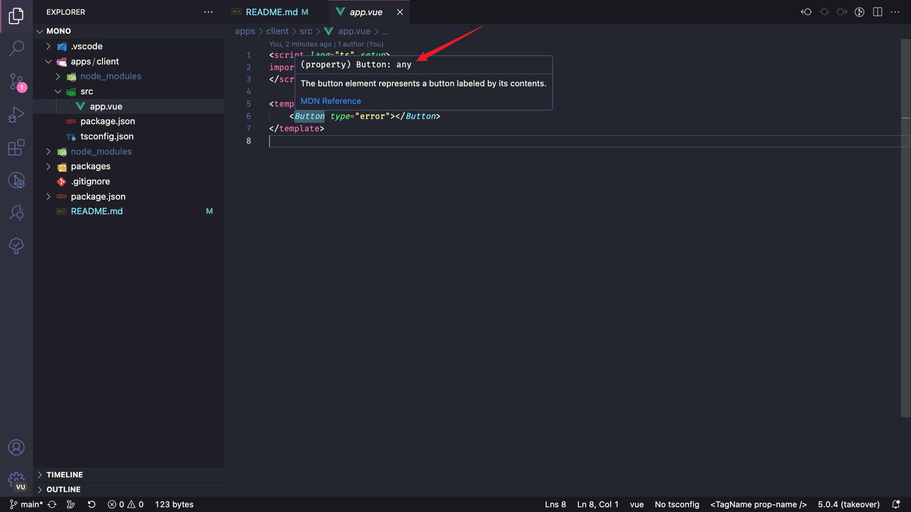

## Reproduce

1. `git clone git@github.com:tjx666/mono.git`
2. `pnpm install`
3. install volar extension v1.8.3, this issue is from v1.8.2
4. open file [./apps/client/src/app.vue](./apps/client/src/app.vue)
5. hover over Button in template block

